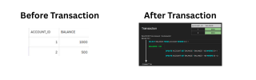
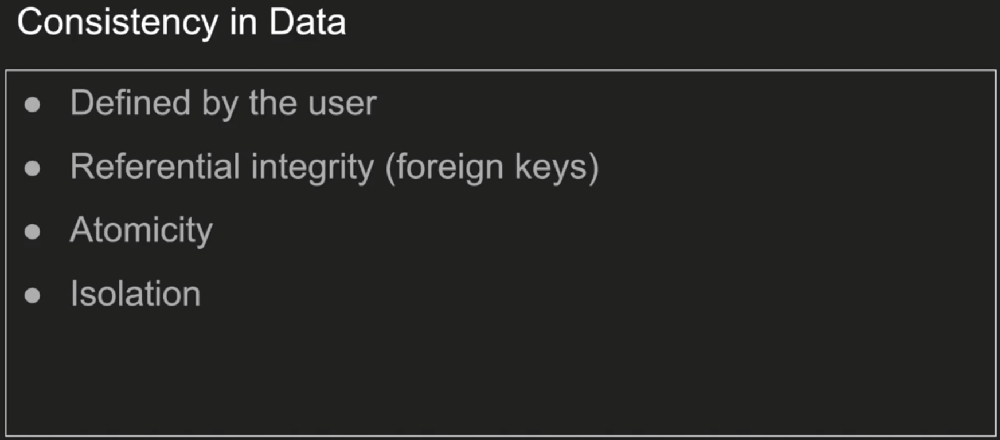
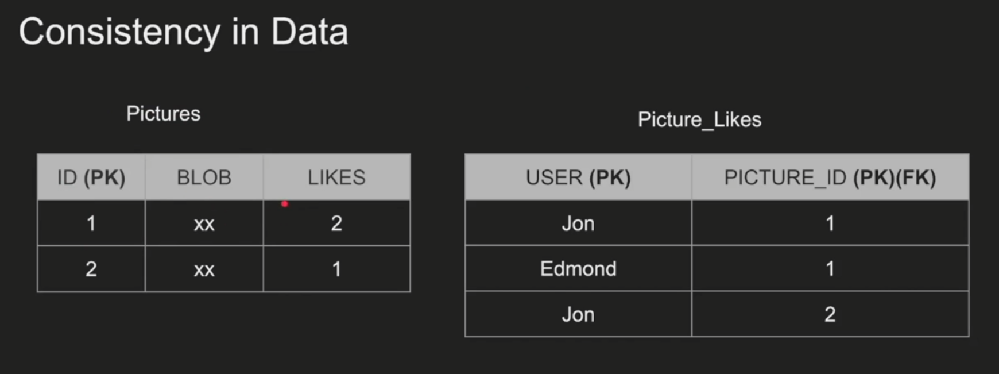
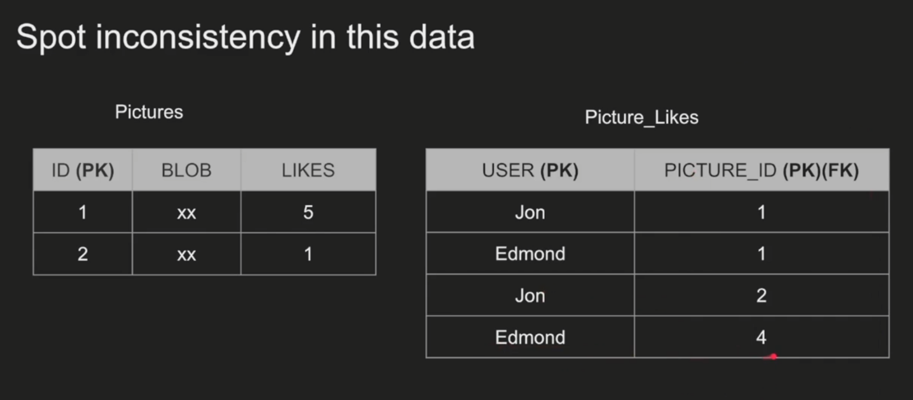
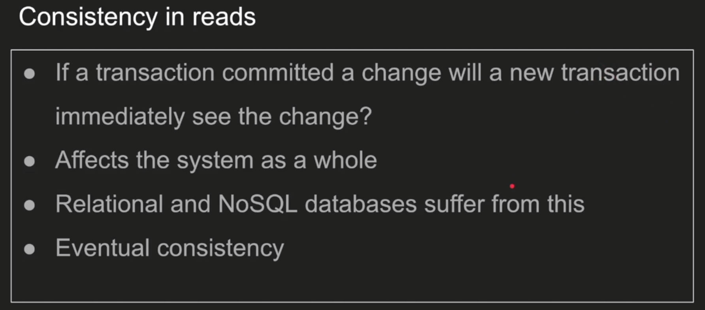
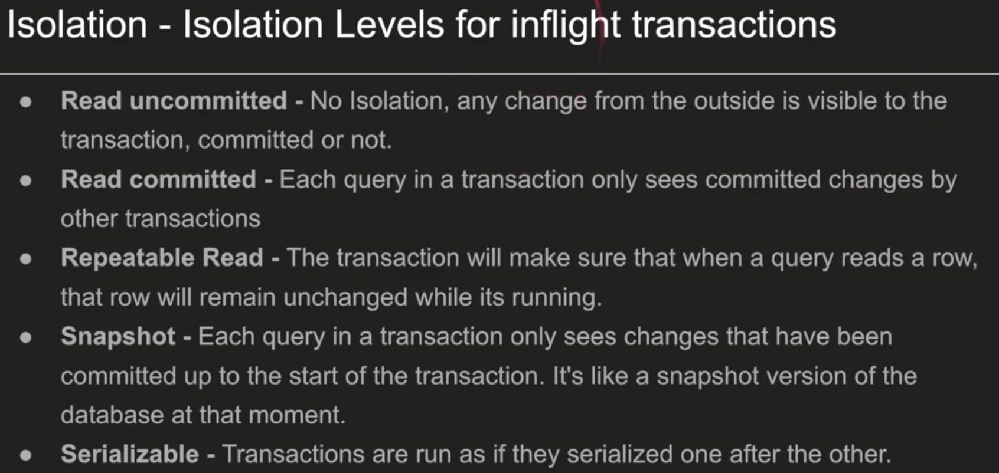
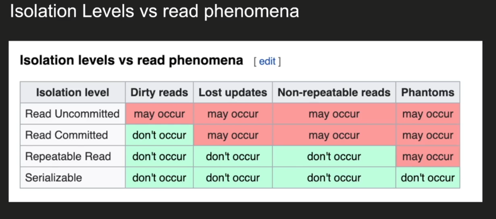
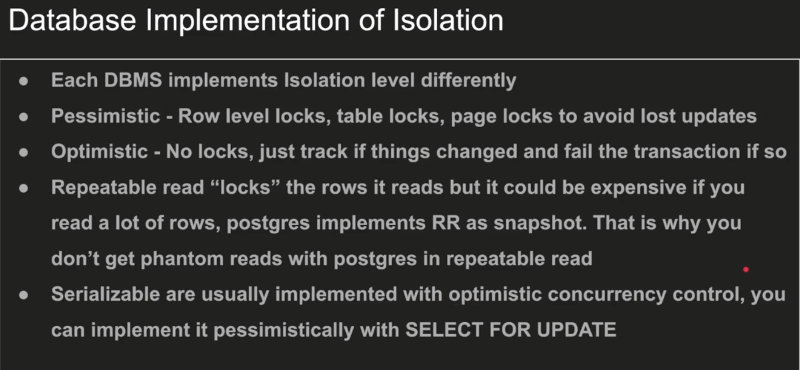

# 1. ACID Principles

## Table of Contents
- [1. ACID Principles](#1-acid-principles)
  - [Table of Contents](#table-of-contents)
  - [Summary](#summary)
  - [1.1. Transaction](#11-transaction)
    - [What](#what)
    - [Why](#why)
    - [How](#how)
      - [Commit Example](#commit-example)
      - [Rollback Example](#rollback-example)
    - [Account Balances](#account-balances)
- [2. ACID Principles Explained](#2-acid-principles-explained)
  - [2.1. Atomicity](#21-atomicity)
    - [What](#what-1)
    - [Why](#why-1)
    - [How](#how-1)
  - [2.2. Consistency](#22-consistency)
    - [What](#what-2)
    - [Why](#why-2)
    - [How](#how-2)
      - [2.2.1. Data Consistency](#221-data-consistency)
      - [2.2.2. Read Consistency](#222-read-consistency)
  - [2.3. Isolation](#23-isolation)
    - [What](#what-3)
    - [Why](#why-3)
    - [How](#how-3)
      - [1. Dirty Read](#1-dirty-read)
      - [2. Non-Repeatable Read](#2-non-repeatable-read)
      - [3. Phantom Read](#3-phantom-read)
      - [4. Lost Update](#4-lost-update)
  - [2.4. Durability](#24-durability)
    - [What](#what-4)
    - [Why](#why-4)
    - [How](#how-4)

---

## Summary

This document explains the ACID principles in database systems, focusing on how transactions work and why ACID properties are essential for data integrity and reliability. Each principle (Atomicity, Consistency, Isolation, Durability) is described with its definition, importance, and practical SQL examples.

---

## 1.1. Transaction

### What
- A collection of *queries* that work as a *unit* of work.

### Why
- A single task may need multiple queries to accomplish a transaction.
- Helps in handling inconsistencies.

### How

#### Commit Example

```sql
-- Start a new transaction
BEGIN TRANSACTION;

-- Step 1: Debit Account A
UPDATE Accounts
SET Balance = Balance - 100
WHERE AccountID = 1;

-- Step 2: Credit Account B
UPDATE Accounts
SET Balance = Balance + 100
WHERE AccountID = 2;

-- Check for potential issues (e.g., insufficient funds in Account A)
-- IF (SELECT Balance FROM Accounts WHERE AccountID = 1) < 0 THEN
--    ROLLBACK TRANSACTION; -- Undo all changes if balance becomes negative
-- ELSE
--    COMMIT TRANSACTION; -- Finalize the changes if no issues
-- END IF;

-- If all operations are successful, commit the transaction
COMMIT TRANSACTION;
```

#### Rollback Example

```sql
BEGIN TRANSACTION;

-- Step 1: Debit Account A
UPDATE Accounts
SET Balance = Balance - 100
WHERE AccountID = 1;

-- Simulate an error or condition that requires a rollback
-- For instance, if Account B does not exist, or if a constraint is violated.
-- In a real application, this would be handled by error checking or exception handling.
-- For demonstration, let's assume an error occurs here.

-- If an error or an unexpected condition arises, undo all changes
ROLLBACK TRANSACTION;
```

### Account Balances

| ACCOUNT_ID | BALANCE (Before) | BALANCE (After) |
|------------|------------------|-----------------|
| 1          | 1000             | 900             |
| 2          | 500              | 600             |



---

# 2. ACID Principles Explained

ACID stands for Atomicity, Consistency, Isolation, and Durability. These are the four key properties that ensure reliable processing of database transactions.

---

## 2.1. Atomicity

### What
- Atomicity ensures that all the <ins>query is treated as a single</ins>, <b>indivisible unit</b>. Either all operations succeed, or none do.

### Why
- Prevents partial updates to the database, which could lead to data corruption or inconsistency.
- After we restarted the machine the first account has been debited but the other account has not been credited.
- This is really bad as we just lost data, and the information is inconsistent
- An atomic transaction is a transaction that will rollback all queries if one or more queries failed.
- The database should clean this up after restart
### How

```sql
BEGIN TRANSACTION;

UPDATE Accounts SET Balance = Balance - 100 WHERE AccountID = 1;
UPDATE Accounts SET Balance = Balance + 100 WHERE AccountID = 2;

-- If any update fails, rollback the entire transaction
ROLLBACK TRANSACTION;

-- If all succeed, commit the transaction
COMMIT TRANSACTION;
```

| Step         | Account 1 | Account 2 | Status         |
|--------------|-----------|-----------|---------------|
| Before Txn   | 1000      | 500       | Initial State |
| After Debit  | 900       | 500       | In Progress   |
| After Credit | 900       | 600       | In Progress   |
| On Failure   | 1000      | 500       | Rolled Back   |
| On Success   | 900       | 600       | Committed     |

---

## 2.2. Consistency

### What
- Consistency ensures that a transaction brings the database from one valid state to another, maintaining all predefined rules and constraints.

### Why
- Guarantees that only valid data is written to the database, preserving data integrity.

### How
There are `2 type` of consistency.
#### 2.2.1. Data Consistency
  
  > Consistent Data Example: 
  
  >Inconsistent Data Example: 
  


#### 2.2.2. Read Consistency

```sql
-- Assume a constraint: Balance >= 0

BEGIN TRANSACTION;

UPDATE Accounts SET Balance = Balance - 1200 WHERE AccountID = 1; -- Would violate constraint

-- This will fail if Balance goes below 0, and the transaction will be rolled back
COMMIT TRANSACTION;
```

| AccountID | Balance Before | Amount Debited | Balance After | Constraint Satisfied? |
|-----------|---------------|----------------|---------------|----------------------|
| 1         | 1000          | 1200           | -200          | No (Rollback)        |

---

## 2.3. Isolation

### What
- Isolation ensures that **concurrent transactions** do not interfere with each other. Each transaction is executed as if it were the only one in the system.

### Why
- Prevents issues like **dirty reads**, **non-repeatable reads**, **phantom reads**, and **lost updates**.

### How
> #### READ PHENOMENA

#### 1. Dirty Read
A transaction reads data written by another uncommitted transaction.

```sql
-- Transaction 1
BEGIN TRANSACTION;
UPDATE Accounts SET Balance = Balance - 100 WHERE AccountID = 1;

-- Transaction 2 (before T1 commits)
BEGIN TRANSACTION;
SELECT Balance FROM Accounts WHERE AccountID = 1; -- Sees uncommitted change
```

| Step              | T1 (Account 1) | T2 Reads | Committed? |
|-------------------|----------------|----------|------------|
| Before T1 Update  | 1000           | 1000     | No         |
| After T1 Update   | 900            | 900      | No         |
| After T1 Rollback | 1000           | 900      | No         |

**Summary**: _Updated_ the result for Transaction T2 read, Even though the T1 RollBack, worst among all.

---

#### 2. Non-Repeatable Read
A transaction reads the same row twice and gets different values because another transaction modified and committed between the reads.

```sql
-- Transaction 1
BEGIN TRANSACTION;
SELECT Balance FROM Accounts WHERE AccountID = 1; -- Reads 1000

-- Transaction 2
BEGIN TRANSACTION;
UPDATE Accounts SET Balance = Balance - 100 WHERE AccountID = 1;
COMMIT TRANSACTION;

-- Transaction 1 (again)
SELECT Balance FROM Accounts WHERE AccountID = 1; -- Reads 900
```

| Step                | T1 Reads | T2 Updates | T1 Reads Again |
|---------------------|----------|------------|----------------|
| Initial             | 1000     |            |                |
| After T2 Update     |          | 900        |                |
| T1 Second Read      |          |            | 900            |

**Summary**: _Updated_ the result for second T1 read, due to T2 commit.

---

#### 3. Phantom Read
A transaction re-executes a query returning a set of rows that satisfy a condition and finds that the set of rows has changed due to another recently-committed transaction.

```sql
-- Transaction 1
BEGIN TRANSACTION;
SELECT * FROM Orders WHERE Amount > 500; -- Returns 2 rows

-- Transaction 2
BEGIN TRANSACTION;
INSERT INTO Orders (OrderID, Amount) VALUES (3, 700);
COMMIT TRANSACTION;

-- Transaction 1 (again)
SELECT * FROM Orders WHERE Amount > 500; -- Returns 3 rows (phantom row appears)
```

| Step                | Orders Table (Amount > 500) |
|---------------------|----------------------------|
| T1 First Read       | Order 1, Order 2           |
| After T2 Insert     | Order 1, Order 2, Order 3  |
| T1 Second Read      | Order 1, Order 2, Order 3  |

**Summary**: _Order 3_ was missing in initial T1. But added in second T1.

---

#### 4. Lost Update
Two transactions read the same data and then update it, with the second update overwriting the first.

```sql
-- Transaction 1
BEGIN TRANSACTION;
SELECT Balance FROM Accounts WHERE AccountID = 1; -- Reads 1000

-- Transaction 2
BEGIN TRANSACTION;
SELECT Balance FROM Accounts WHERE AccountID = 1; -- Reads 1000

-- Both transactions update
UPDATE Accounts SET Balance = 900 WHERE AccountID = 1; -- T1
UPDATE Accounts SET Balance = 950 WHERE AccountID = 1; -- T2

COMMIT TRANSACTION; -- T1
COMMIT TRANSACTION; -- T2 (T1's update is lost)
```

| Step                | T1 Update | T2 Update | Final Balance |
|---------------------|-----------|-----------|--------------|
| Initial             |           |           | 1000         |
| After T1 Update     | 900       |           | 900          |
| After T2 Update     |           | 950       | 950          |
| After Both Commits  |           |           | 950          |

**Summary**: _Override_ your transaction by other concurrent transactions.








---

## 2.4. Durability

### What
- Durability ensures that once a transaction is committed, its changes are permanent, even in the event of a system failure.

### Why
- Guarantees that committed data will `not be lost`, providing reliability.

### How

```sql
BEGIN TRANSACTION;
UPDATE Accounts SET Balance = Balance + 200 WHERE AccountID = 2;
COMMIT TRANSACTION;
-- Even if the system crashes now, the change will persist after recovery.
```

| Event                | Account 2 Balance |
|----------------------|------------------|
| Before Transaction   | 600              |
| After Update         | 800              |
| After Commit         | 800              |
| After Crash/Restart  | 800              |

---


