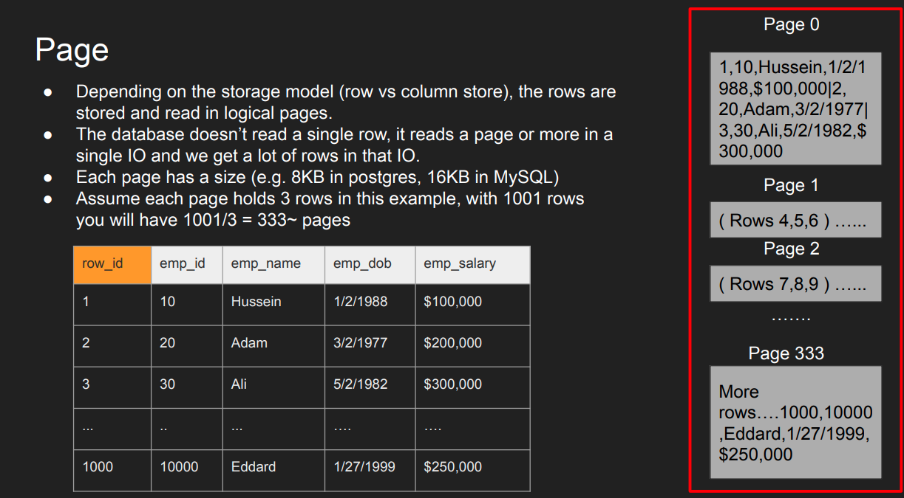
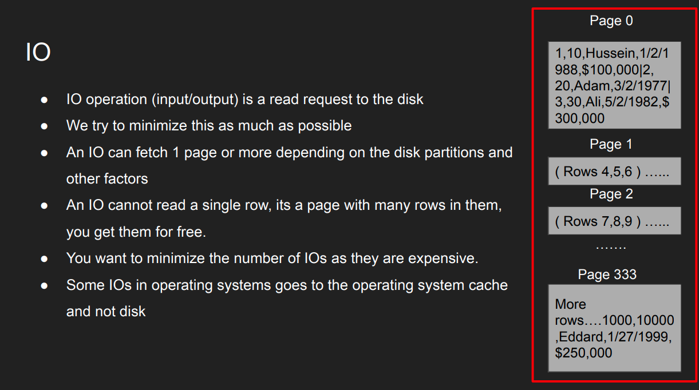
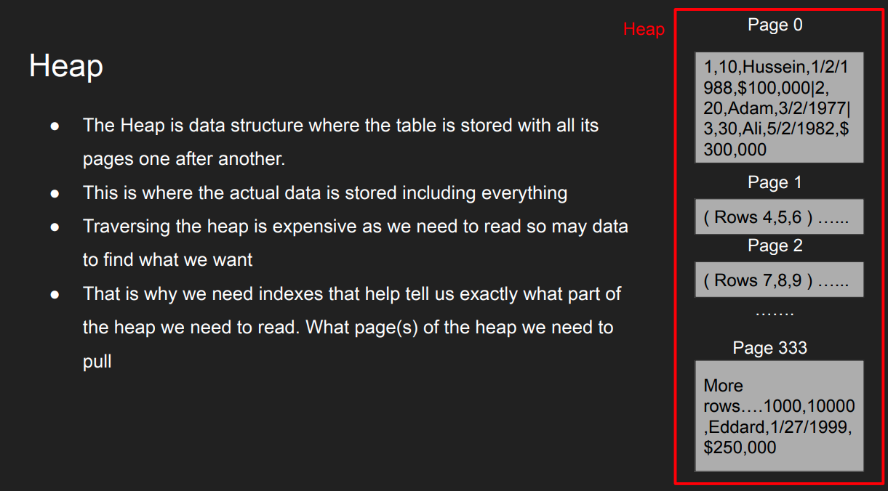
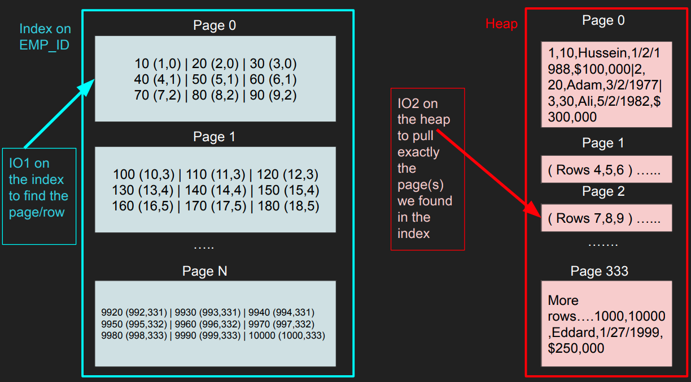

# Internal Database Storage Concepts

This document explains how databases store tables and indexes on disk, covering key storage concepts and structures.

---

## Table

- A **table** is a logical structure that stores data in rows and columns.
- Physically, tables are stored as collections of data pages on disk.

## Row ID

- Each row in a table is uniquely identified by a **Row ID** (or physical address).
- The Row ID helps the database engine locate and retrieve rows efficiently.

## Page

- Data is stored on disk in fixed-size blocks called **pages** (commonly 4KB or 8KB).
- Each page contains multiple rows from a table.
- Pages are the basic unit of I/O between disk and memory.


## I/O (Input/Output)

- **I/O** refers to reading from or writing to disk.
- Databases optimize I/O by reading/writing entire pages, not individual rows.



## Heap Data Structure

- A **heap** is a table storage structure where rows are stored in no particular order.
- New rows are added wherever space is available.
- Suitable for tables without a clustered index.
  


## Index Data Structure: B-Tree

- Most database indexes use a **B-tree** (balanced tree) structure.
- B-trees allow fast searching, insertion, and deletion.
- Indexes store pointers to the actual data rows (via Row IDs or page addresses).
- An index is another data structure separate from the heap that has “pointers” to the heap.
- It has part of the data and used to quickly search for something You can index on one column or more.
- Once you find a value of the index, you go to the heap to fetch more information where everything is there.
- Index tells you EXACTLY which page to fetch in the heap instead of taking the hit to scan every page in the heap.
- The index is also stored as pages and cost IO to pull the entries of the index.
- The smaller the index, the more it can fit in memory the faster the search.
- Popular data structure for index is b-trees, learn more on that in the b-tree section.



## Example of a Query

Suppose you have a table `Users` with an index on the `username` column:

```sql
SELECT * FROM Users WHERE username = 'alice';
```

**How it works:**
1. The database uses the B-tree index to quickly locate the Row ID(s) for `'alice'`.
2. It reads the corresponding page(s) from disk into memory.
3. The row data is retrieved and returned to the user.

---

**Summary Table**

| Concept         | Description                                              |
|-----------------|---------------------------------------------------------|
| Table           | Logical structure for storing rows and columns          |
| Row ID          | Unique identifier for each row                          |
| Page            | Fixed-size block of data on disk                        |
| I/O             | Disk operations for reading/writing pages               |
| Heap            | Unordered storage for table rows                        |
| B-tree Index    | Balanced tree for fast